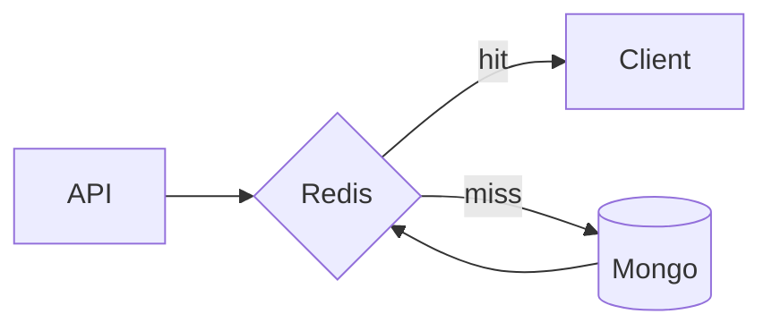

# Redis

Draft note.

I try not to think of Redis as "makes things faster," and more as moving a consistency boundary (staleness, invalidation, failure modes).

Main footgun for me: caching aggregates without a clear invalidation owner.
